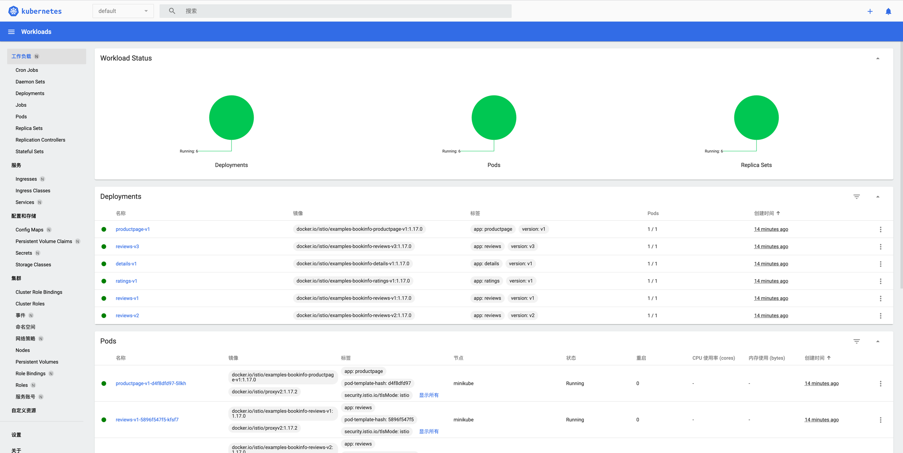

# macos-m1下快速运行istio

# 安装docker并启动
# 安装kubectl命令行
## 下载kubectl工具
```shell
curl -LO "https://dl.k8s.io/release/v1.27.0/bin/darwin/arm64/kubectl"
```
## 赋予可执行权限
```shell
chmod +x ./kubectl
```
## 将kubectl移动到环境变量所在path并变更所有者
```shell
sudo mv ./kubectl /usr/local/bin/kubectl
sudo chown root: /usr/local/bin/kubectl
```
## 测试
```shell
kubectl version --client
```
# 安装minikube
## 下载minikube
```shell
curl -LO https://storage.googleapis.com/minikube/releases/latest/minikube-darwin-arm64
sudo install minikube-darwin-arm64 /usr/local/bin/minikube
```
## 设置基本参数
```shell
# 虚拟机环境的 CPU 数
minikube config set cpus 4
# 虚拟机环境的内存（单位：MB）。官方提供的参数是 16G，个人建议尽量设大一点。但个人测试机器docker最大16G这里设置为10G。
minikube config set memory 10240
# 将 minikube 的驱动设置为 Docker。
minikube config set driver docker
```
## 启动minikube
```shell
minikube start #可选--image-mirror-country='cn'
```
## 验证
```shell
kubectl get node
```
## 安装dashboard（可选）
```shell
minikube dashboard
```

# 安装istio
## 下载istio
```shell
curl -L https://istio.io/downloadIstio | sh -
#指定版本
#curl -L https://istio.io/downloadIstio | ISTIO_VERSION=1.17.2 TARGET_ARCH=x86_64 sh -
```
## 配置环境变量
```shell
cd istio-1.17.2
export PATH=$PWD/bin:$PATH
```
## 验证安装
```shell
istioctl -h
```
## 给ns打label开启sidecar自动注入
```shell
kubectl label namespace default istio-injection=enabled
```