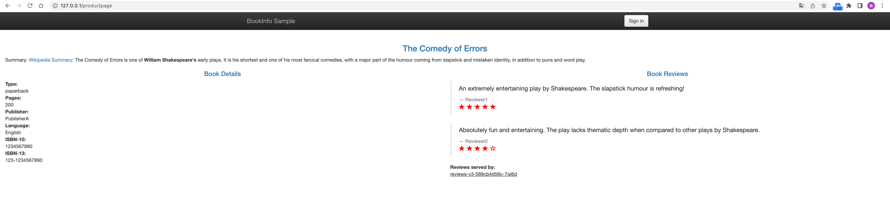
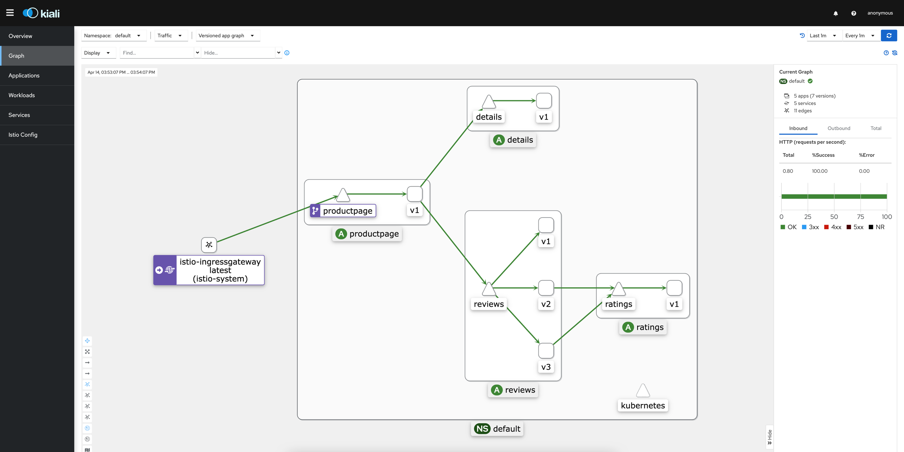

# istio demo
## 部署实例应用

### 创建bookinfo应用
```shell
xiaohan@xiaohandeMacBook-Pro istio-1.17.2 % kubectl apply -f samples/bookinfo/platform/kube/bookinfo.yaml
service/details created
serviceaccount/bookinfo-details created
deployment.apps/details-v1 created
service/ratings created
serviceaccount/bookinfo-ratings created
deployment.apps/ratings-v1 created
service/reviews created
serviceaccount/bookinfo-reviews created
deployment.apps/reviews-v1 created
deployment.apps/reviews-v2 created
deployment.apps/reviews-v3 created
service/productpage created
serviceaccount/bookinfo-productpage created
deployment.apps/productpage-v1 created
```
### 查看启动情况，其中pod在初始化过程中
```shell
xiaohan@xiaohandeMacBook-Pro istio-1.17.2 % kubectl get svc,po
NAME                  TYPE        CLUSTER-IP       EXTERNAL-IP   PORT(S)    AGE
service/details       ClusterIP   10.103.135.185   <none>        9080/TCP   2m2s
service/kubernetes    ClusterIP   10.96.0.1        <none>        443/TCP    44m
service/productpage   ClusterIP   10.109.23.203    <none>        9080/TCP   2m1s
service/ratings       ClusterIP   10.106.169.119   <none>        9080/TCP   2m2s
service/reviews       ClusterIP   10.104.118.194   <none>        9080/TCP   2m2s

NAME                                 READY   STATUS            RESTARTS   AGE
pod/details-v1-6997d94bb9-cndcs      0/2     PodInitializing   0          2m2s
pod/productpage-v1-d4f8dfd97-5llkh   0/2     PodInitializing   0          2m1s
pod/ratings-v1-b8f8fcf49-xxxhc       2/2     Running           0          2m2s
pod/reviews-v1-5896f547f5-kfsf7      0/2     PodInitializing   0          2m1s
pod/reviews-v2-5d99885bc9-nlfph      0/2     PodInitializing   0          2m1s
pod/reviews-v3-589cb4d56c-7qj6d      0/2     PodInitializing   0          2m1s
```
### 启动成功后
```shell
xiaohan@xiaohandeMacBook-Pro ~ % kubectl get po,svc       
NAME                                 READY   STATUS    RESTARTS   AGE
pod/details-v1-6997d94bb9-cndcs      2/2     Running   0          13m
pod/productpage-v1-d4f8dfd97-5llkh   2/2     Running   0          13m
pod/ratings-v1-b8f8fcf49-xxxhc       2/2     Running   0          13m
pod/reviews-v1-5896f547f5-kfsf7      2/2     Running   0          13m
pod/reviews-v2-5d99885bc9-nlfph      2/2     Running   0          13m
pod/reviews-v3-589cb4d56c-7qj6d      2/2     Running   0          13m

NAME                  TYPE        CLUSTER-IP       EXTERNAL-IP   PORT(S)    AGE
service/details       ClusterIP   10.103.135.185   <none>        9080/TCP   13m
service/kubernetes    ClusterIP   10.96.0.1        <none>        443/TCP    55m
service/productpage   ClusterIP   10.109.23.203    <none>        9080/TCP   13m
service/ratings       ClusterIP   10.106.169.119   <none>        9080/TCP   13m
service/reviews       ClusterIP   10.104.118.194   <none>        9080/TCP   13m
```
其中每个pod都被注入了sidecar
### 验证部署情况
```shell
xiaohan@xiaohandeMacBook-Pro ~ % kubectl exec "$(kubectl get pod -l app=ratings -o jsonpath='{.items[0].metadata.name}')" -c ratings -- curl -sS productpage:9080/productpage | grep -o "<title>.*</title>"
<title>Simple Bookstore App</title>
```
## 创建访问入口
此时，BookInfo 应用已经部署，但还不能被外界访问。 要开放访问，需要创建 Istio 入站网关（Ingress Gateway）， 它会在网格边缘把一个路径映射到路由。
### 应用关联到 Istio 网关（创建gateway和vs）
```shell
xiaohan@xiaohandeMacBook-Pro istio-1.17.2 % kubectl apply -f samples/bookinfo/networking/bookinfo-gateway.yaml
gateway.networking.istio.io/bookinfo-gateway created
virtualservice.networking.istio.io/bookinfo created
```
### 确定入站ip和端口
#### 新起一个终端执行
```shell
minikube tunnel
```

#### 设置入站ip和端口
```shell
xiaohan@xiaohandeMacBook-Pro istio-1.17.2 % export INGRESS_HOST=$(kubectl -n istio-system get service istio-ingressgateway -o jsonpath='{.status.loadBalancer.ingress[0].ip}')
xiaohan@xiaohandeMacBook-Pro istio-1.17.2 % export INGRESS_PORT=$(kubectl -n istio-system get service istio-ingressgateway -o jsonpath='{.spec.ports[?(@.name=="http2")].port}')
xiaohan@xiaohandeMacBook-Pro istio-1.17.2 % export SECURE_INGRESS_PORT=$(kubectl -n istio-system get service istio-ingressgateway -o jsonpath='{.spec.ports[?(@.name=="https")].port}')
xiaohan@xiaohandeMacBook-Pro istio-1.17.2 % echo "$INGRESS_HOST"
127.0.0.1
xiaohan@xiaohandeMacBook-Pro istio-1.17.2 % echo "$INGRESS_PORT"
80
xiaohan@xiaohandeMacBook-Pro istio-1.17.2 % echo "$SECURE_INGRESS_PORT"
443
```
#### 设置环境变量GATEWAY_URL
```shell
xiaohan@xiaohandeMacBook-Pro istio-1.17.2 % export GATEWAY_URL=$INGRESS_HOST:$INGRESS_PORT
xiaohan@xiaohandeMacBook-Pro istio-1.17.2 % echo "$GATEWAY_URL"
127.0.0.1:80
```
### 访问验证
```shell
xiaohan@xiaohandeMacBook-Pro istio-1.17.2 % echo "http://$GATEWAY_URL/productpage"
http://127.0.0.1:80/productpage
```
打开：http://127.0.0.1:80/productpage


## 安装仪表盘
### 部署 Kiali 仪表板、 以及 Prometheus、 Grafana、 还有 Jaeger
```shell
xiaohan@xiaohandeMacBook-Pro istio-1.17.2 % kubectl apply -f samples/addons
serviceaccount/grafana created
configmap/grafana created
service/grafana created
deployment.apps/grafana created
configmap/istio-grafana-dashboards created
configmap/istio-services-grafana-dashboards created
deployment.apps/jaeger created
service/tracing created
service/zipkin created
service/jaeger-collector created
serviceaccount/kiali created
configmap/kiali created
clusterrole.rbac.authorization.k8s.io/kiali-viewer created
clusterrole.rbac.authorization.k8s.io/kiali created
clusterrolebinding.rbac.authorization.k8s.io/kiali created
role.rbac.authorization.k8s.io/kiali-controlplane created
rolebinding.rbac.authorization.k8s.io/kiali-controlplane created
service/kiali created
deployment.apps/kiali created
serviceaccount/prometheus created
configmap/prometheus created
clusterrole.rbac.authorization.k8s.io/prometheus created
clusterrolebinding.rbac.authorization.k8s.io/prometheus created
service/prometheus created
deployment.apps/prometheus created
xiaohan@xiaohandeMacBook-Pro istio-1.17.2 % kubectl rollout status deployment/kiali -n istio-system
Waiting for deployment "kiali" rollout to finish: 0 of 1 updated replicas are available...
deployment "kiali" successfully rolled out
```
### 访问Kiali仪表板
```shell
xiaohan@xiaohandeMacBook-Pro istio-1.17.2 % istioctl dashboard kiali
http://localhost:20001/kiali
```
### 在左侧的导航菜单，选择 Graph ，然后在 Namespace 下拉列表中，选择 default 。
### 多次刷新BookInfo页面，再次进入kiali的graph页面刷新可以看到调用链路 //或者执行如下脚本
```shell
for i in `seq 1 100`; do curl -s -o /dev/null http://$GATEWAY_URL/productpage; done
```
